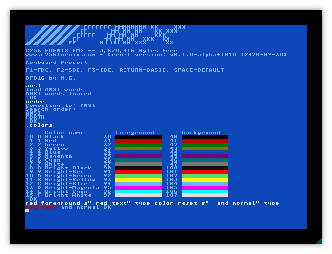
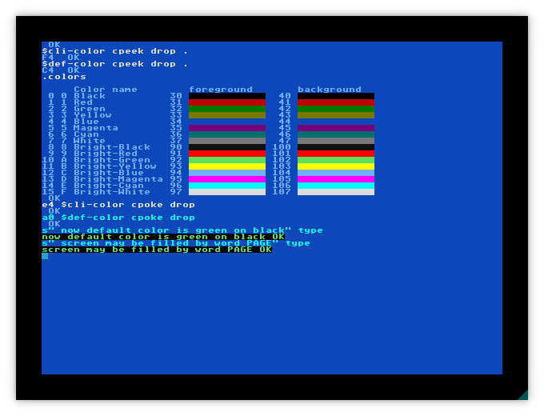
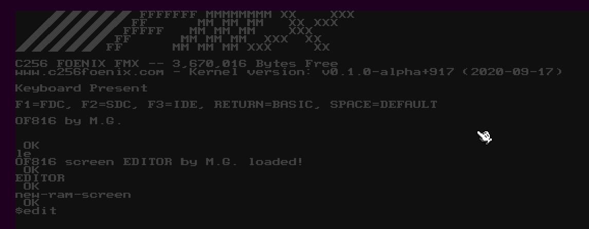
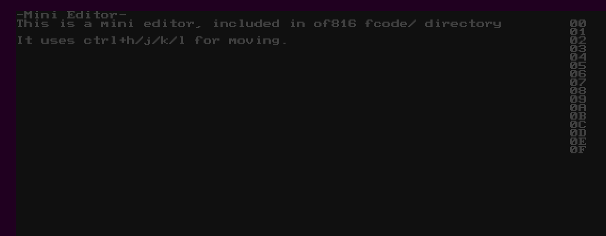
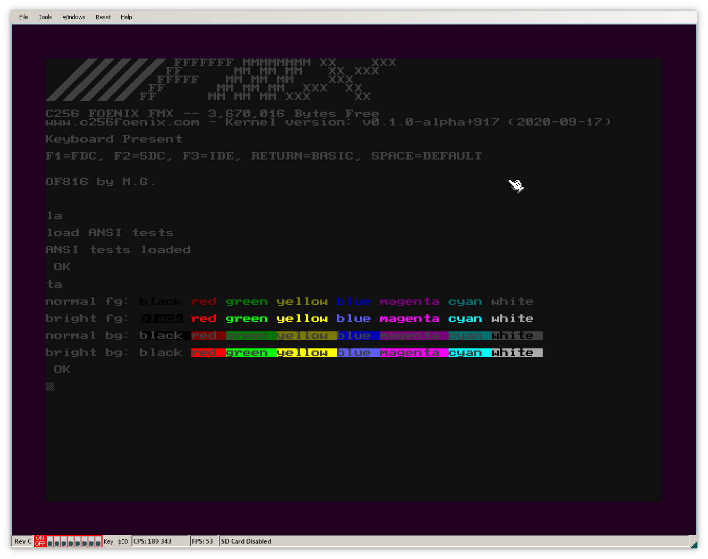

# Changelog

All notable changes to this project will be documented in this file.

The format is based on [Keep a Changelog](https://keepachangelog.com/en/1.1.0/),
and this project adheres to [Semantic Versioning](https://semver.org/spec/v2.0.0.html).

## 2025-07-22

* update `.td` word to support 24/12 modes
* add `set-clock-24` and `set-clock-12` to change clock mode 

## 2025-07-20

* synced with upstream repository: adapted to newer versions cc65
* separate changelog introduced
* add `get-time` OpenFirmware word and custom `.td` time and date
  printing word

## 2021-05-08 - Eye-candy edition.

* New default font - a mix of Atari ST one with box drawing characters
  from original C256 Kernel. They can be disabled by setting ``alt_font``
  to ``0`` in ``platform-config.inc`` and recompiling binary.
* New default colors. They can be changed manually later or - in near
  future - by default initialization file
* ``ansi`` word now load ANSI-related words (see screenshots)
* ``.colors`` words displays color table (yes! C256 has **two** different
  lookups tables for fore- and background colors and that means 32 colors
  on single screen) with additional information that can be used later
* Command-line from now has distinct, configurable color (see screenshots)
* Two screenshots stands for thousands of words. Or something like that.
    
    

## 2021-05-02 

Important milestone was achieved - initial words for file input. They are 
not compatible with ANSI, but it is a subject to change.

* To addres possible increased requirements for file-loading capabilities, 
  memory for of816 was increased to 1MB
* line-ending sequences: LF, CR/LF and CR are treated in the same way,
  as single CR
* ``.DIR`` *( -- )* - prints directory (SD card only)
* ``file-load`` *( c-addr u -- c-addr u ior )* - takes string and returns
  memory address and data length followed by I/O status (0 means 'ok')
  Example: ``s" test.fs" file-load``
* ``code-run`` *( c-addr u -- )* - takes filename, reads file (source), call
  ``eval`` on data and free memory.
* ``byte-run`` *( c-addr u -- )* - takes filename, reads file (fcode) and
  then calls ``byte-load``. Memory is freed.
* ``build.sh`` can be called with ``debug`` parameter. Script creates
  additional file, ``forth-debug.hex``, thats overwrites part of BASIC 
  and starts of816 directly after upload by debug port. 

## 2021-04-14 

Better integration with Foenix systems: of816 now is located at lower memory 
addresses and can be run by issuing ``brun "forth.pgx"`` from BASIC.

After ``BYE`` a reset routine is called.

## 2020-10-13 

CUP/ED sequences support - now words AT-XY and PAGE works!

From now print routines silently skip over LF character - this is an
workaround for default C256 kernel that treats CR like original Commodore 
(line down and go to column 0) and LF as "one line down" that leads 
to redundant empty lines. 

OF816 forth contains sample editor that may be tested in following way:

## 2020-10-11
Foundations for ANSI codes support and working 3/4 bit SGR code.

See [fcode/ansi.fs](fcode/ansi.fs) for working examples and syntax for 
OpenFirmware hex code support in strings.

