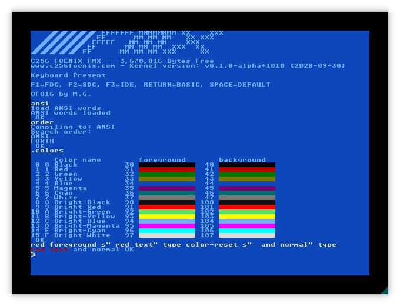
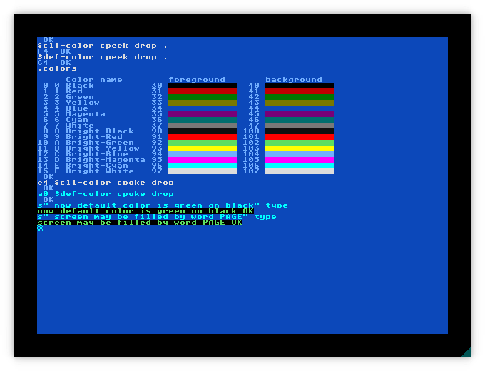
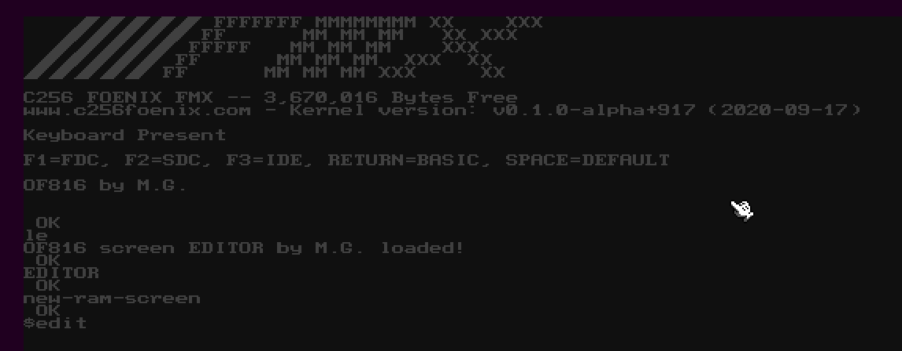
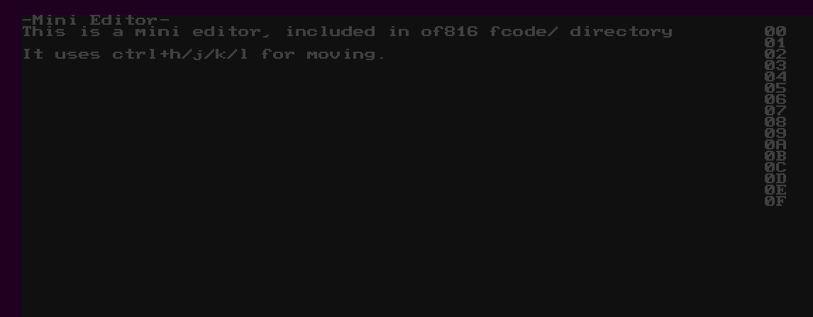

# C256 Foenix (FMX)

This is port to [C256 Foenix](https://c256foenix.com/) system. [It works](https://www.youtube.com/watch?v=fsYlth-gQSA&feature=youtu.be)
on:
* C256 FMX Rev C4
* FoenixU/U+
* emulators (see below)

The port itself relies on default [FMX Kernel](https://github.com/Trinity-11/Kernel_FMX/).

It works in [Foenix IDE](https://github.com/Trinity-11/FoenixIDE) from
version [0.5.3.1](https://github.com/Trinity-11/FoenixIDE/releases), 
see [below](#on-foenixide) for instructions. 

It is possible to run current, unmodified version of this port on 
[go65c816 emulator](https://github.com/aniou/go65c816), see README.md
in go65c816 repository for [instructions](https://github.com/aniou/go65c816#running-forth).

## Latest changes

* 2021-05-08: Eye-candy edition.

    * New default font - a mix of Atari ST one with box drawing characters
      from original C256 Kernel. They can be disabled by setting ``alt_font``
      to ``0`` in ``platform-config.inc`` and recompiling binary.
    * New default colors. They can be changed manually later or - in near
      future - by default initialization file
    * ``ansi`` word now load ANSI-related words (see screenshots)
    * ``.colors`` words displays color table (yes! C256 has **two** different
      lookups tables for fore- and background colors and that means 32 colors
      on single screen) with additional information that can be used later
    * Command-line from now has distinct, configurable color (see screenshots)
    * Two screenshots stands for thousands of words. Or something like that.
        
        

* 2021-05-02: Important milestone was achieved - initial words for file
  input. They are not compatible with ANSI, but it is a subject to change.

    * To addres possible increased requirements for file-loading capabilities, 
      memory for of816 was increased to 1MB
    * line-ending sequences: LF, CR/LF and CR are treated in the same way,
      as single CR
    * ``.DIR`` *( -- )* - prints directory (SD card only)
    * ``file-load`` *( c-addr u -- c-addr u ior )* - takes string and returns
      memory address and data length followed by I/O status (0 means 'ok')
      Example: ``s" test.fs" file-load``
    * ``code-run`` *( c-addr u -- )* - takes filename, reads file (source), call
      ``eval`` on data and free memory.
    * ``byte-run`` *( c-addr u -- )* - takes filename, reads file (fcode) and
      then calls ``byte-load``. Memory is freed.
    * ``build.sh`` can be called with ``debug`` parameter. Script creates
      additional file, ``forth-debug.hex``, thats overwrites part of BASIC 
      and starts of816 directly after upload by debug port. 

* 2021-04-14: Better integration with Foenix systems: of816 now is located
  at lower memory addresses and can be run by issuing ``brun "forth.pgx"``
  from BASIC.

  After ``BYE`` a reset routine is called.

* 2020-10-13: CUP/ED sequences support - now words AT-XY and PAGE works!

  From now print routines silently skip over LF character - this is an
  workaround for default C256 kernel that treats CR like original Commodore 
  (line down and go to column 0) and LF as "one line down" that leads 
  to redundant empty lines. 
  
  OF816 forth contains sample editor that may be tested in following way:
  
   
  
   

* 2020-10-11: foundations for ANSI codes support and working 3/4 bit SGR code.

  See [fcode/ansi.fs](fcode/ansi.fs) for working examples and syntax for 
  OpenFirmware hex code support in strings.


## Compiling

Port requires following utilities to be in `$PATH` to compile:

* `srec_cat` (from `srecord` package on Ubuntu) to generate `*.hex` files
* `ca65` and `ld65` from [CC65 development package](https://cc65.github.io/)

To compile package simply go into `of816/platforms/C256/` and run `./build.sh`,
after that You should see three files:

* `forth` - raw binary code
* `forth.hex` - 32bit Intel Hex format
* `forth.pgx` - a costom C256 program format, that can be put on SD card/floppy/HDD

## Using

### On real hardware

Code itself may be uploaded to FMX via debug USB port using
[C256Mgr tool](https://github.com/pweingar/C256Mgr)

Example call on Ubuntu:
```code
# python3.7 C256Mgr/C256Mgr/c256mgr.py --port /dev/ttyXRUSB0 --upload forth.hex
```

Originally forth code was loaded at ``$3a:0000`` (in place of BASIC) and
was started automatically after upload. Now is required to call it directly
by issuing ``call 65536`` or ``call &H10000`` commands.

### On FoenixIDE 

FoenixIDE works on Windows and Linux, under Wine (tested on Kubuntu 20.04).

1. Run emulator (default kernel should be loaded into memory automatically),
   and load ```forth.hex``` using *File->Load Hex File w/o Zeroing*
   
   
   
2. Run emulation (by F5, for example), there should be a starting screen:

   

3. Call forth by issuing command ``call 65536``

## Internals 

### Current memory map

```
$00:8000 - $00:80FF   - ZP of forth system 
$00:8100 - $00:8FFF   - FORTH stack
$00:9000 - $00:9FFF   - FORTH return stack
$01:0000 - $01:FFFF   - FORTH routines
$02:0000 - $11:FFFF     FORTH dictionary   (1MB)
```

### Note about SD cards

Current Foenixes (FMX, U/U+) requires a SD card (not HC, XC nor microSD).
Card should be formatted as ``FAT32`` with **one sector per cluster**, ie.
**512 bytes**!

Typical SD card is often formatted as ``FAT16`` (it wouldn't work) and
card formatted as ``FAT32`` on default settings will likely have a 16 
sectors per cluster (it wouldn't work too).

Under linux, If Your card is detected as ``/dev/sdd`` with one partition,
marked as ``W95 FAT32 (LBA)`` (id: ``$0c``) then valid parameters for mkfs 
will be:

```
mkfs.vfat -F 32 -s 1 -S 512 /dev/sdd1
```

Properly formatted filesystem should looks like:

```
# fsck.vfat -nv /dev/sdd1
fsck.fat 4.1 (2017-01-24)
Checking we can access the last sector of the filesystem
Boot sector contents:
System ID "mkfs.fat"
Media byte 0xf8 (hard disk)
       512 bytes per logical sector
       512 bytes per cluster
        32 reserved sectors
First FAT starts at byte 16384 (sector 32)
         2 FATs, 32 bit entries
  15438336 bytes per FAT (= 30153 sectors)
Root directory start at cluster 2 (arbitrary size)
Data area starts at byte 30893056 (sector 60338)
   3859534 data clusters (1976081408 bytes)
62 sectors/track, 62 heads
      2048 hidden sectors
   3919872 sectors total
```

```
# fatcat -i /dev/sdd1
FAT Filesystem information

Filesystem type: FAT32
OEM name: mkfs.fat
Total sectors: 3919872
Total data clusters: 3859584
Data size: 1976107008 (1.84039G)
Disk size: 2006974464 (1.86914G)
Bytes per sector: 512
Sectors per cluster: 1
Bytes per cluster: 512
Reserved sectors: 32
Sectors per FAT: 30153
```

```
# LANG=C fdisk -l /dev/sdd
Disk /dev/sdd: 1.89 GiB, 2008023040 bytes, 3921920 sectors
Disk model: SD/MMC Reader   
Units: sectors of 1 * 512 = 512 bytes
Sector size (logical/physical): 512 bytes / 512 bytes
I/O size (minimum/optimal): 512 bytes / 512 bytes
Disklabel type: dos
Disk identifier: 0x00000000

Device     Boot Start     End Sectors  Size Id Type
/dev/sdd1        2048 3921919 3919872  1.9G  c W95 FAT32 (LBA)
```
