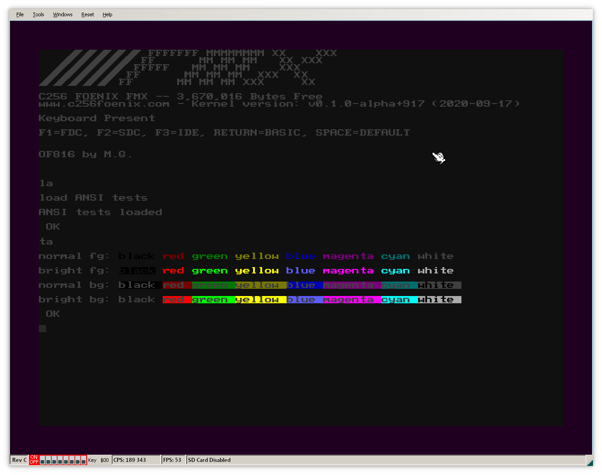
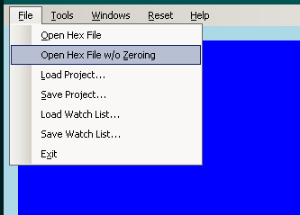
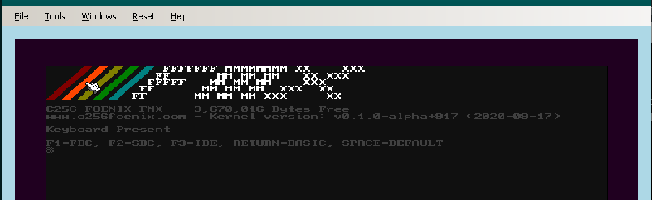
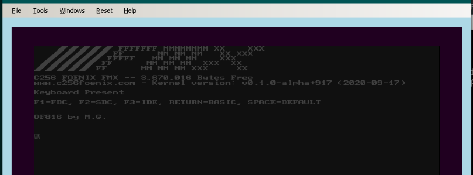

# C256 Foenix (FMX)

This is port to [C256 Foenix](https://c256foenix.com/) system. [It works](https://www.youtube.com/watch?v=fsYlth-gQSA&feature=youtu.be)
on real hardware, C256 FMX Rev C4A and on emulators.

The port itself relies on default [FMX Kernel](https://github.com/Trinity-11/Kernel_FMX/)
but replaces included [BASIC](https://github.com/pweingar/BASIC816) 

It works in [Foenix IDE](https://github.com/Trinity-11/FoenixIDE) from
sersion [0.5.3.1](https://github.com/Trinity-11/FoenixIDE/releases), 
see [below](#on-foenixide) for instructions. 

It will be possible to run current, unmodified version of this port on 
[go65c816 emulator](https://github.com/aniou/go65c816)  in near future 
(code and instructions will be published soon).

## Latest changes

* 2020-10-11: foundations for ANSI codes support and working 3/4 bit SGR code.

  See [fcode/ansi.fs] for working examples and syntax for OpenFirmware hex
  code support in strings.




## Compiling

Port requires following utilities to be in `$PATH` to compile:

* `srec_cat` (from `srecord` package on Ubuntu) to generate `*.hex` files
* `ca65` and `ld65` from [CC65 development package](https://cc65.github.io/)

To compile package simply go into `of816/platforms/C256/` and run `./build.sh`,
after that You should see two files - `forth` (binary code) and `forth.hex` (same,
but in 32bit Intel Hex format)

## Using

### On real hardware

Code itself may be uploaded to FMX via debug USB port using
[C256Mgr tool](https://github.com/pweingar/C256Mgr)

Example call on Ubuntu:
```code
# python3.7 C256Mgr/C256Mgr/c256mgr.py --port /dev/ttyXRUSB0 --upload forth.hex
```

### On FoenixIDE 

FoenixIDE works on Windows and Linux, under Wine (tested on Kubuntu 20.04).

1. Run emulator (default kernel should be loaded into memory automatically),
   and load ```forth.hex``` using *File->Load Hex File w/o Zeroing*
   
   
   
2. Run emulation (by F5, for example), there should be a starting screen:

   

3. Wait for awhile or press enter - the rainbow should change color and
   forth interpreter should be loaded in place of default Basic

   


## Some notes about memory location

Program itself overwrites BASIC at addr `$3A:0000`, uses memory range between
`$01:0000` and `$02:0000` and Bank0 area between `$9000` and `$AFFFF`.

Provided values may be subjects to change in future.
