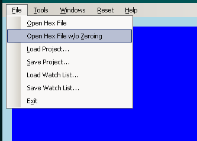
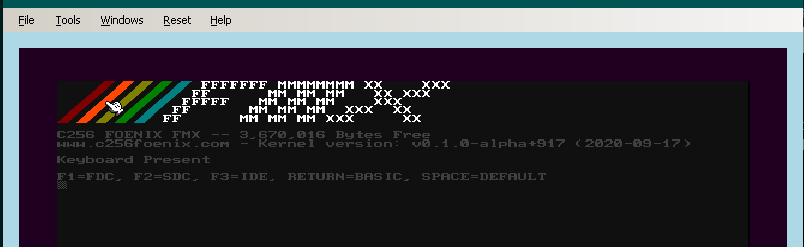

# C256 Foenix (FMX)

This is port to [C256 Foenix](https://c256foenix.com/) system. 
[It works](https://www.youtube.com/watch?v=fsYlth-gQSA&feature=youtu.be) on:

* C256 FMX Rev C4
* FoenixU/U+
* emulators like [FoenixIDE](https://github.com/Trinity-11/FoenixIDE)
  or [Morfe/o](https://github.com/aniou/morfeo)

The port itself relies on routines provided by default 
[FMX Kernel](https://github.com/Trinity-11/Kernel_FMX/).

## Latest changes

Take a look at [CHANGELOG](CHANGELOG.md)!

## Compiling

Port requires following utilities to be available in `$PATH` to compile:

* `srec_cat` (from `srecord` package on Ubuntu) to generate `*.hex` files
* `ca65` and `ld65` from [CC65 development package](https://cc65.github.io/)
* `toke` from [OpenBIOS FCode Suite](https://www.openbios.org/FCODE_suite.html)

To compile package simply go into `of816/platforms/C256/` and run `./build.sh`,
after that You should see three files:

* `forth` - raw binary code
* `forth.hex` - 32bit Intel Hex format
* `forth.pgx` - a costom C256 program format, that can be put on SD card/floppy/HDD

There is also additional binary for FMX/U+ machines, that overrides parts of 
BASIC816 and may be used to quick start via serial or emulator: `forth-debug.hex`,
created by calling `./build.sh debug`.

## Using

### On real hardware

Code itself may be uploaded to FMX via debug USB port using
[FoenixMgr tool](https://github.com/pweingar/FoenixMgr)

Example call on Ubuntu:
```code
# python3 ~/foenix/FoenixMgr/FoenixMgr/fnxmgr.py --port /dev/ttyUSB0 --upload forth.hex
```

Originally forth code was loaded at ``$3a:0000`` (in place of BASIC) and
was started automatically after upload. Now is required to call it directly
by issuing ``call 65536`` or ``call &H10000`` commands or - on FMX/U+ machines
- by using `forth-debug.hex` binary.

### On FoenixIDE 

FoenixIDE works on Windows and Linux, under Wine (tested on Kubuntu 20.04).

1. Run emulator (default kernel should be loaded into memory automatically),
   and load ```forth.hex``` using *File->Load Hex File w/o Zeroing*
   
   
   
2. Run emulation (by F5, for example), there should be a starting screen:

   

3. Call forth by issuing command ``call 65536``

## Internals 

### Current memory map

```
$00:8000 - $00:80FF   - ZP of forth system 
$00:8100 - $00:8FFF   - FORTH stack
$00:9000 - $00:9FFF   - FORTH return stack
$01:0000 - $01:FFFF   - FORTH routines
$02:0000 - $11:FFFF     FORTH dictionary   (1MB)
```

### Note about SD cards

Current Foenixes (FMX, U/U+) requires a SD card (not HC, XC nor microSD).
Card should be formatted as ``FAT32`` with **one sector per cluster**, ie.
**512 bytes**!

Typical SD card is often formatted as ``FAT16`` (it wouldn't work) and
card formatted as ``FAT32`` on default settings will likely have a 16 
sectors per cluster (it wouldn't work too).

Under linux, If Your card is detected as ``/dev/sdd`` with one partition,
marked as ``W95 FAT32 (LBA)`` (id: ``$0c``) then valid parameters for mkfs 
will be:

```
mkfs.vfat -F 32 -s 1 -S 512 /dev/sdd1
```

Properly formatted filesystem should looks like:

```
# fsck.vfat -nv /dev/sdd1
fsck.fat 4.1 (2017-01-24)
Checking we can access the last sector of the filesystem
Boot sector contents:
System ID "mkfs.fat"
Media byte 0xf8 (hard disk)
       512 bytes per logical sector
       512 bytes per cluster
        32 reserved sectors
First FAT starts at byte 16384 (sector 32)
         2 FATs, 32 bit entries
  15438336 bytes per FAT (= 30153 sectors)
Root directory start at cluster 2 (arbitrary size)
Data area starts at byte 30893056 (sector 60338)
   3859534 data clusters (1976081408 bytes)
62 sectors/track, 62 heads
      2048 hidden sectors
   3919872 sectors total
```

```
# fatcat -i /dev/sdd1
FAT Filesystem information

Filesystem type: FAT32
OEM name: mkfs.fat
Total sectors: 3919872
Total data clusters: 3859584
Data size: 1976107008 (1.84039G)
Disk size: 2006974464 (1.86914G)
Bytes per sector: 512
Sectors per cluster: 1
Bytes per cluster: 512
Reserved sectors: 32
Sectors per FAT: 30153
```

```
# LANG=C fdisk -l /dev/sdd
Disk /dev/sdd: 1.89 GiB, 2008023040 bytes, 3921920 sectors
Disk model: SD/MMC Reader   
Units: sectors of 1 * 512 = 512 bytes
Sector size (logical/physical): 512 bytes / 512 bytes
I/O size (minimum/optimal): 512 bytes / 512 bytes
Disklabel type: dos
Disk identifier: 0x00000000

Device     Boot Start     End Sectors  Size Id Type
/dev/sdd1        2048 3921919 3919872  1.9G  c W95 FAT32 (LBA)
```
